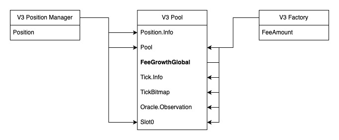
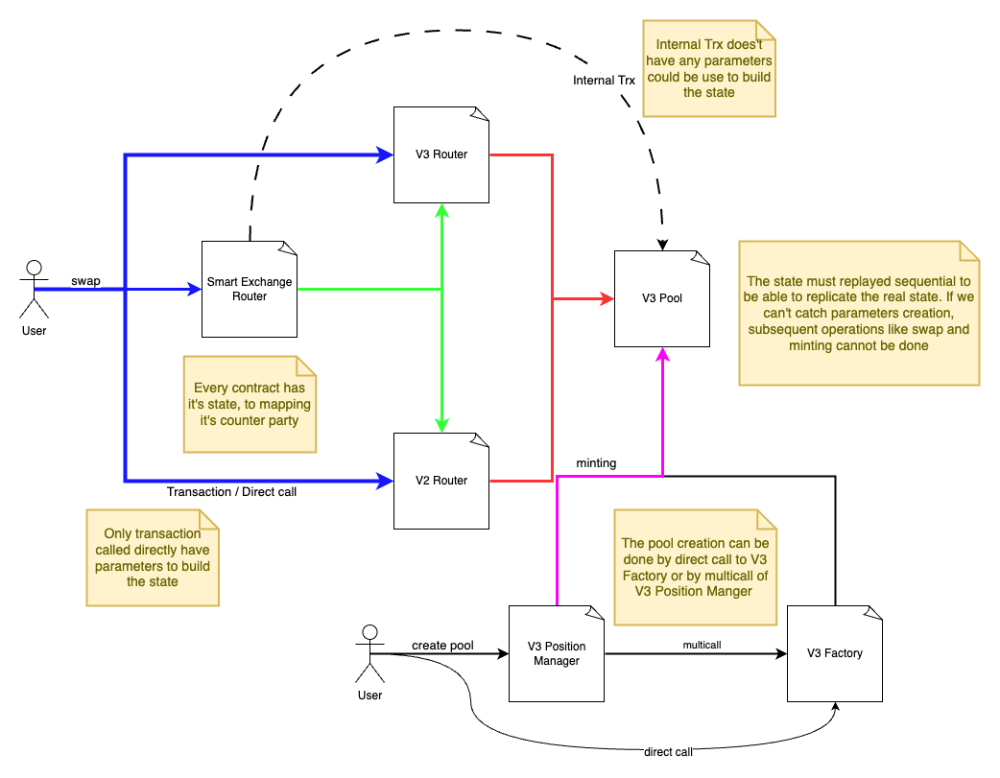
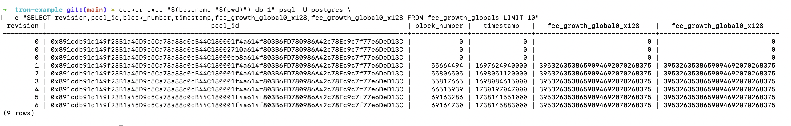

# SunSwapV3 pool state reconstruction

This is a technical report jointly written by @abernatskiy and @anandameyer.

## Context

Unlike EVM, Tron disallows querying contract state at an arbitrary block height. This is an issue for indexers that require such historical values. For example, it makes it much more difficult to replicate the functionality of the [uniswap-v3 squid](https://github.com/subsquid-labs/uniswapv3-squid) (and its more widely known [subgraph prototype](https://github.com/Uniswap/v3-subgraph/)) on Tron.

Indeed, the only possible approach to obtaining this data is to replay the contracts' state updating logic based on transactions and possibly logs data, partially or in full. Usefulness of this approach goes beyond Tron, as Solana-based chains have similar limitations.

Here, we describe an attempt at reconstructing the state of the SunSwap V3 pool contracts by @anandameyer, commissioned by @abernatskiy and SQD as an SQD Boost program task. The more narrow task was to reconstruct the history of changes of two contract variables `feeGrowthGlobal0X128` and `feeGrowthGlobal1X128` that are unaccessible via events.

## What was done

1. By looking at contract events [such as these](https://tronscan.io/#/contract/TTbvjUk7gxTRVMmVN4v6uLR9pEcfmg9vH9/events), @ananameyer found out that the state of the pool contract typically changes due to transactions made against other contracts, namely the Smart Exchange Router, V2 Router, V3 Router and V3 Position Manager (for liquidity changes). See a rough interaction diagram below.

   

2. He also found that the contract state is initialized on creation in `multicall` transations such as [this one](https://tronscan.io/#/transaction/fad623625d38f464ad3422c8dcd53a2032524bf9839cabd1b6d23ba2f0645618).

   

3. Solidity code for all SunSwap V3 contracts was obtained from **add source repo** and translated into TypeScript (see `src/contracts`). An LLM (**add LLM name**) was used in the interest of time. Libraries that the contracts relied upon were also translated (see `src/libraries`).
4. After replaying the pool state initialization, @anandameyer found that liquidity and amount minted did not match.
5. The Solidity contracts were deployed to a Remix VM as a test, but they didn't work as a whole **please how exactly they failed**.
6. Replaying `Swap`-inducing transactions against the virtual TypeScript contracts, @anandameyer managed to get some of the relevant state to change:

   

## Lessons

* Reconstruction of contract state from transactions should be avoided. If a virtual contract state is desired it's better to use fine-grained data such as state diffs or traces (on EVM) or instructions (on Solana). Tron is uniquely challeging because it doesn't provide any such data.
* Reconstruction of contract state from transactions will typically have to be performed for the whole system of contracts forming a service. It will usually not be possible to consider a single contract in isolation.
* Expect to translate the libraries used by the contracts, too.
* Before translating the contracts into TypeScript, they should be deployed to a VM and tested.
* VM tests should be translated into TypeScript and the translated contract code should be tested againts them.
